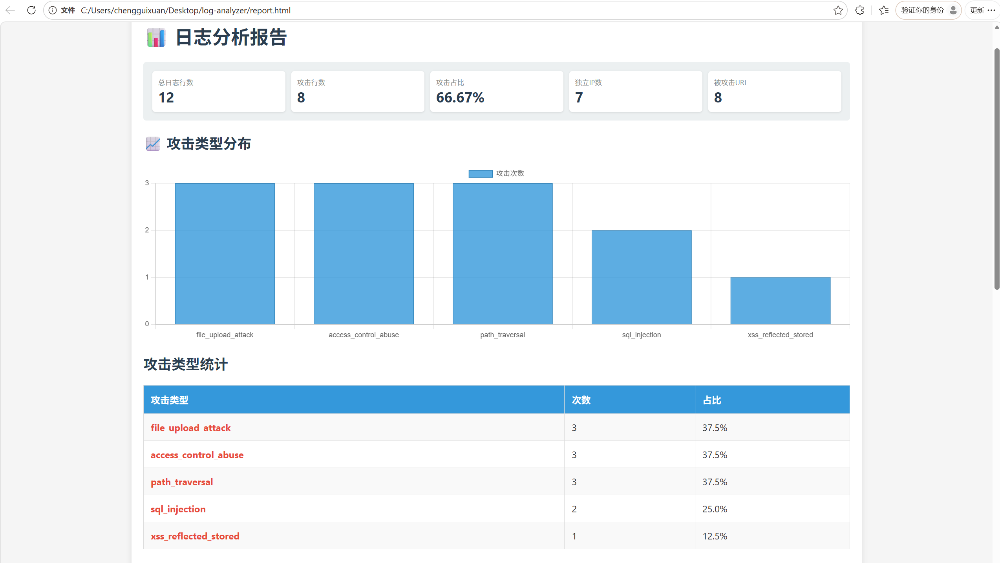
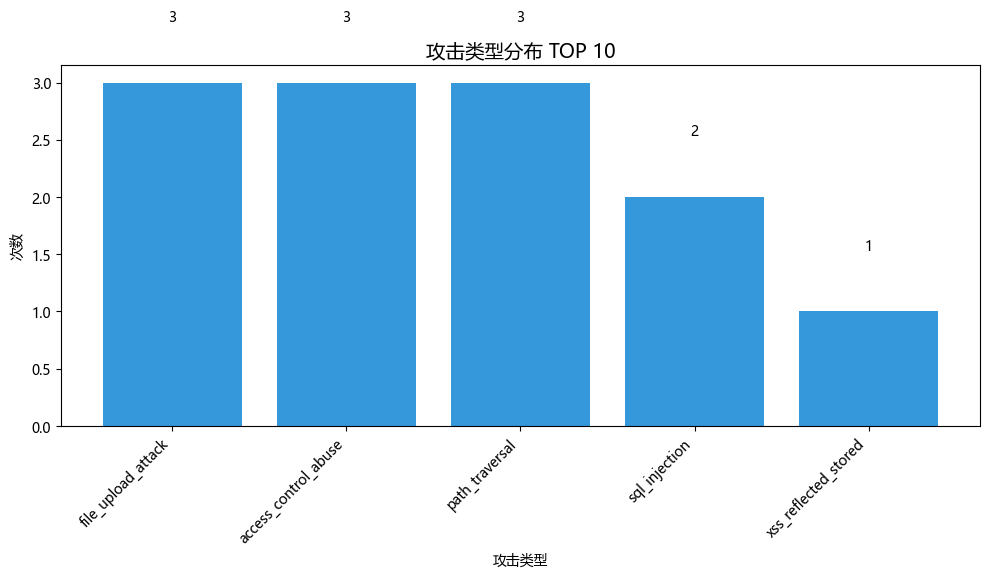

# 智能日志分析系统

一个用 Python 编写的 Web 日志分析工具，自动检测 SQL注入、XSS、路径遍历等攻击，生成可视化报告。

## ✨ 功能特性

- 📁 支持 **Nginx**、**Apache**（combined/common）日志格式
- 🔍 检测 **11 种常见 Web 攻击**（SQL注入、XSS、路径遍历、命令注入、SSRF、文件上传等）
- 📊 生成多种报告：**命令行统计**、**HTML 可视化报告**、**JSON 数据导出**
- 📈 **攻击类型分布图**（柱状图）
- ⚙️ **可自定义攻击规则**（`config/attack_patterns.json`）
- 🧩 **模块化设计**，易于扩展

## 🚀 快速开始

### 环境要求
- Python 3.8+
- Git

### 安装

```bash
# 克隆项目
git clone https://github.com/Chengguixuan/log-analyzer
cd log-analyzer

# 安装依赖（图表功能需要 matplotlib）
python -m pip install matplotlib
使用示例
bash
# 基础分析（Nginx 日志）
python main.py -f samples/nginx_access.log -t nginx

# 生成 HTML 报告
python main.py -f samples/nginx_access.log -t nginx --html report.html

# 生成攻击类型分布图
python main.py -f samples/nginx_access.log -t nginx --chart chart.png

# 完整输出（JSON + HTML + 图表）
python main.py -f samples/nginx_access.log -t nginx -o result.json --html report.html --chart chart.png

# 分析 Apache 日志
python main.py -f samples/apache_combined.log -t apache_combined
📁 项目结构
text
log-analyzer/
├── main.py                 # 主程序入口
├── modules/
│   ├── parser.py          # 日志解析器
│   ├── detector.py        # 攻击检测器
│   ├── reporter.py        # 报告生成器
│   └── chart.py           # 图表生成器
├── config/
│   ├── attack_patterns.json   # 攻击规则库
│   └── log_formats.json       # 日志格式配置
├── samples/               # 测试日志样例
├── requirements.txt       # 依赖列表
└── README.md
📊 输出示例
命令行报告
text
============================================================
 日志分析报告
============================================================
总日志行数: 12
发现攻击行数: 8
攻击占比: 66.67%

[+] 攻击类型统计:
  sql_injection: 3次
  xss: 2次
  path_traversal: 2次

[+] 攻击源IP TOP5:
  45.155.205.233: 共5次攻击 (主要: path_traversal)
  10.0.0.50: 共2次攻击 (主要: sql_injection)
  ...
HTML 报告


攻击类型分布图


⚙️ 自定义规则
编辑 config/attack_patterns.json 可添加或修改检测规则：

json
{
  "sql_injection": {
    "description": "SQL注入攻击",
    "patterns": [
      "union.*select",
      "or\\s+\\d+=\\d+",
      "sleep\\("
    ]
  },
  "xss": {
    "description": "XSS攻击",
    "patterns": [
      "<script>",
      "onerror=",
      "javascript:"
    ]
  }
}
🛠️ 日志格式配置
支持自定义日志格式，编辑 config/log_formats.json：

json
{
  "nginx": {
    "pattern": "^(\\S+) - - \\[(.*?)\\] ...",
    "fields": ["ip", "time", "method", "url", "status", "size", "referer", "ua"]
  }
}